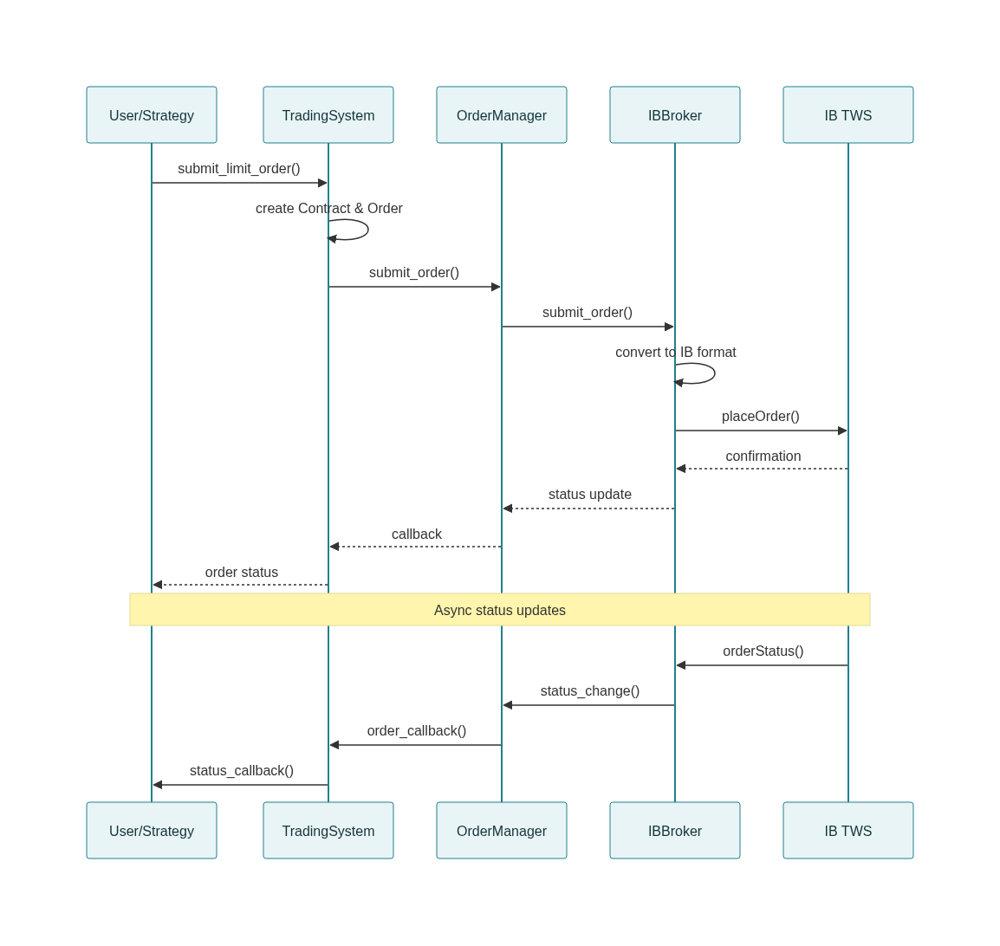
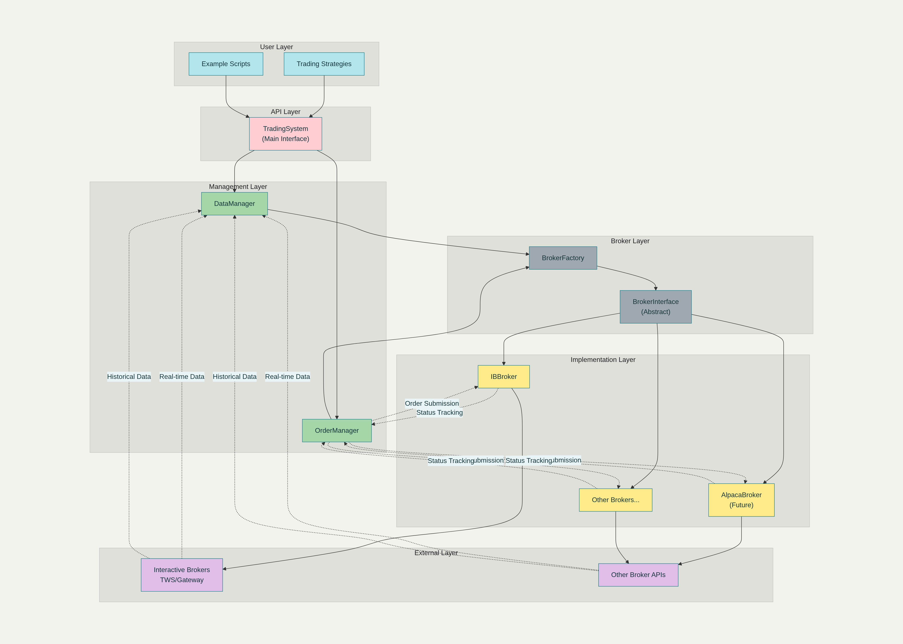

# Modular Trading System

A comprehensive, modular Python trading system designed to work with Interactive Brokers and easily extensible to other brokers and exchanges. This system provides a unified interface for algorithmic trading, historical data retrieval, order management, and real-time market data processing.

## Features

### Core Functionality
- **Historical Data Retrieval**: Get OHLCV data with customizable timeframes
- **Order Management**: Submit, track, and cancel orders with full status monitoring
- **Real-time Market Data**: Subscribe to live price feeds with callback support
- **Multi-Broker Support**: Modular architecture allows easy addition of new brokers
- **Data Persistence**: SQLite database for caching data and storing order/trade history
- **Account Management**: Access account information and positions across brokers


### Architecture

- **Broker Abstraction Layer**: Unified interface for different brokers
- **Factory Pattern**: Easy instantiation and management of broker connections
- **Event-Driven**: Callback system for order updates and market data
- **Modular Design**: Clean separation of concerns for easy maintenance and extension

### Key Components
**BrokerInterface**: Abstract base class that defines the interface all brokers must implement. This ensures consistency across different broker implementations.
**DataManager**: Handles historical and real-time data, including caching, retrieval, and storage in SQLite database.
**OrderManager**: Manages order lifecycle, tracks status, and maintains order history with complete audit trail.
**BrokerFactory**: Factory pattern implementation for creating broker instances with proper configuration.

### Supported Features
- **Order Types**: Market, Limit, Stop, Stop-Limit orders
- **Asset Classes**: Stocks, Forex, Futures, Options, Commodities
- **Time in Force**: DAY, GTC, IOC, FOK
- **Position Tracking**: Real-time position monitoring
- **Trade History**: Complete audit trail of all transactions

## Installation

### Prerequisites

1. **Python 3.7 or higher**
2. **Interactive Brokers TWS or IB Gateway** (for IB integration)
3. **Required Python packages**:

```bash
pip install pandas sqlite3 ibapi
```

### Interactive Brokers Setup

1. **Download and install TWS or IB Gateway** from Interactive Brokers
2. **Enable API access**:
   - Open TWS/Gateway
   - Go to File Global Configuration API Settings
   - Check "Enable ActiveX and Socket Clients"
   - Set Socket port (7497 for paper trading, 7496 for live)
   - Check "Allow connections from localhost only"
   - Optionally check "Read-Only API" for testing

3. **Create paper trading account** (recommended for testing)

### System Setup

1. **Clone or download the trading system files**
2. **Install the package** (optional):
```bash
pip install -e .
```

3. **Configure settings** in `config.json`:
```json
{
  "brokers": {
    "interactive_brokers": {
      "host": "127.0.0.1",
      "port": 7497,
      "client_id": 1
    }
  }
}
```

## Quick Start

### Basic Usage Example

```python
from trading_system.main import TradingSystem

# Initialize the system
trading_system = TradingSystem()

# Add Interactive Brokers
trading_system.add_broker(
    name="ib_paper",
    broker_type="ib",
    host="127.0.0.1",
    port=7497,
    client_id=1
)

# Get historical data
hist_data = trading_system.get_historical_data(
    symbol="AAPL",
    exchange="SMART",
    duration="5 D",
    bar_size="1 hour"
)

print(hist_data.head())

# Submit a limit order
order_id = trading_system.submit_limit_order(
    symbol="AAPL",
    exchange="SMART", 
    action="BUY",
    quantity=100,
    limit_price=150.00,
    broker_name="ib_paper"
)

# Check order status
status = trading_system.get_order_status(order_id)
print(f"Order status: {status}")

# Clean shutdown
trading_system.shutdown()
```

### Running the Examples

**Basic functionality example**:
```bash
python example_usage.py
```

**Simple trading strategy**:
```bash
python strategy_example.py
```

## API Reference

### TradingSystem Class

The main interface for the trading system.

#### Methods

**Broker Management**
- `add_broker(name, broker_type, **config)` - Add and connect to a broker
- `remove_broker(name)` - Remove and disconnect from a broker

**Historical Data**
- `get_historical_data(symbol, exchange, duration, bar_size, ...)` - Get historical OHLCV data

**Market Data**
- `subscribe_market_data(symbol, exchange, callback, ...)` - Subscribe to real-time data

**Order Management**
- `submit_market_order(symbol, exchange, action, quantity, broker_name, ...)` - Submit market order
- `submit_limit_order(symbol, exchange, action, quantity, limit_price, broker_name, ...)` - Submit limit order
- `submit_stop_order(symbol, exchange, action, quantity, stop_price, broker_name, ...)` - Submit stop order
- `cancel_order(order_id)` - Cancel an order
- `get_order_status(order_id)` - Get order status
- `get_all_orders()` - Get all orders

**Account Information**
- `get_positions(broker_name)` - Get current positions
- `get_account_info(broker_name)` - Get account information

**Data Export**
- `export_historical_data(symbol, exchange, start_date, end_date, filename)` - Export data to CSV

**History**
- `get_order_history(symbol, start_date, end_date)` - Get order history
- `get_trade_history(symbol, start_date, end_date)` - Get trade history

### Contract Specification

```python
from trading_system.brokers.base_broker import Contract

contract = Contract(
    symbol="AAPL",           # Symbol
    security_type="STK",     # STK, CASH, FUT, OPT, etc.
    exchange="SMART",        # Exchange
    currency="USD",          # Currency
    expiry="20231215",       # For futures/options
    strike=150.0,            # For options
    right="C"                # C for Call, P for Put
)
```

### Order Specification

```python
from trading_system.brokers.base_broker import Order, OrderType, OrderAction

order = Order(
    action=OrderAction.BUY,     # BUY or SELL
    quantity=100,               # Number of shares/contracts
    order_type=OrderType.LIMIT, # MARKET, LIMIT, STOP, STOP_LIMIT
    limit_price=150.00,         # For limit orders
    stop_price=145.00,          # For stop orders
    time_in_force="DAY"         # DAY, GTC, IOC, FOK
)
```

## Architecture Overview

### Directory Structure
```
trading_system/
__init__.py
main.py                 # Main TradingSystem class
brokers/
   __init__.py
   base_broker.py      # Abstract broker interface
   broker_factory.py   # Broker factory
   interactive_brokers/
       __init__.py
       ib_broker.py    # IB implementation
data/
  __init__.py
  data_manager.py     # Data management
orders/
   __init__.py
   order_manager.py    # Order management
strategies/
  __init__.py

config/
   __init__.py
   config.py           # Configuration management
```

## Adding New Brokers

To add a new broker (e.g., Alpaca, TD Ameritrade):

1. **Create broker implementation**:
```python
# trading_system/brokers/alpaca/alpaca_broker.py
from ..base_broker import BrokerInterface

class AlpacaBroker(BrokerInterface):
    def connect(self, **kwargs):
        # Implementation here
        pass

    def get_historical_data(self, contract, duration, bar_size, what_to_show):
        # Implementation here
        pass

    # ... implement all required methods
```

2. **Register with factory**:
```python
# trading_system/brokers/broker_factory.py
from .alpaca.alpaca_broker import AlpacaBroker
BrokerFactory.register_broker('alpaca', AlpacaBroker)
```

3. **Use the new broker**:
```python
trading_system.add_broker(
    name="alpaca_live",
    broker_type="alpaca",
    api_key="your_key",
    secret_key="your_secret"
)
```

## Examples and Testing

### Running Tests

Basic functionality test:
```bash
python example_usage.py
```

Strategy backtesting:
```bash
python strategy_example.py
```
