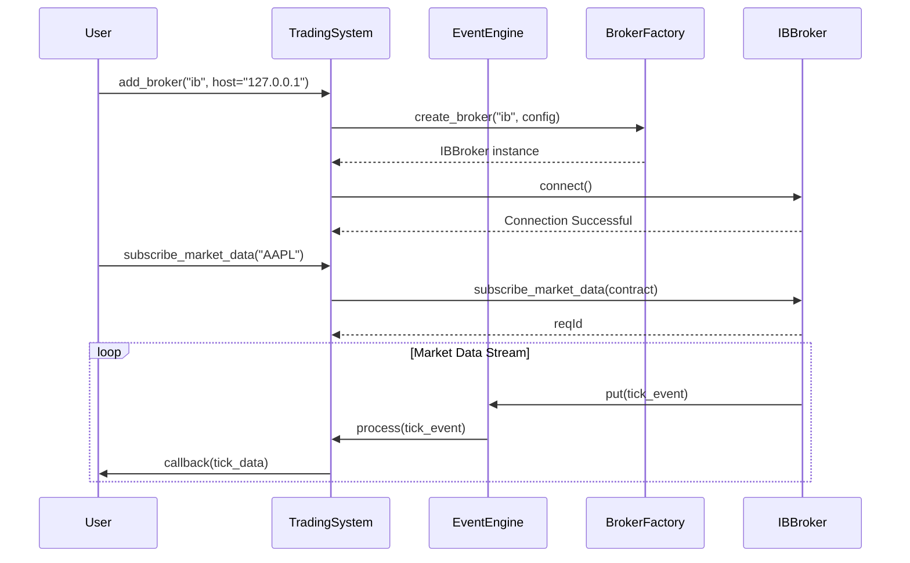
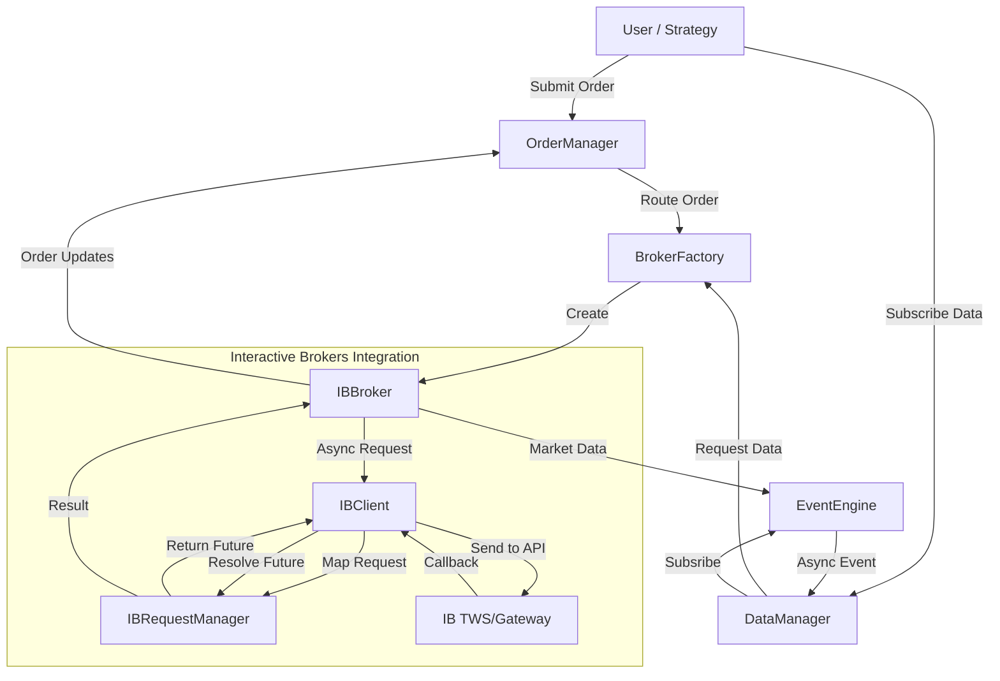
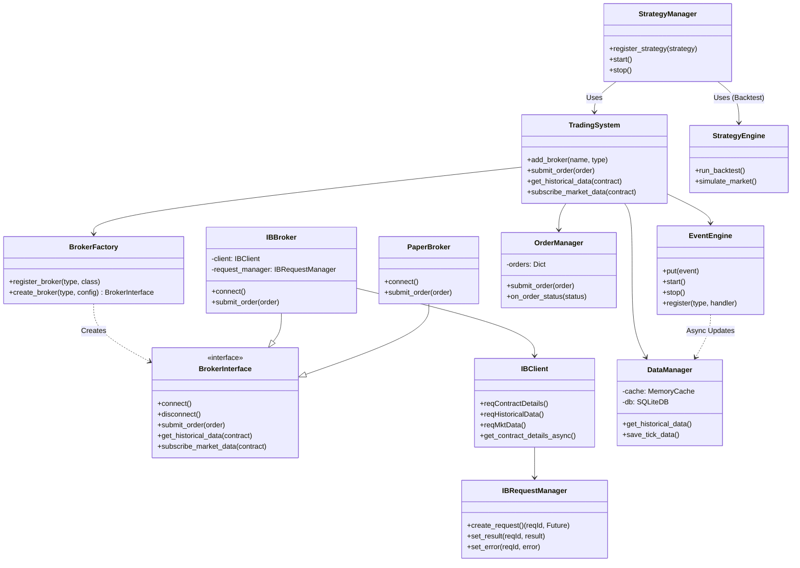
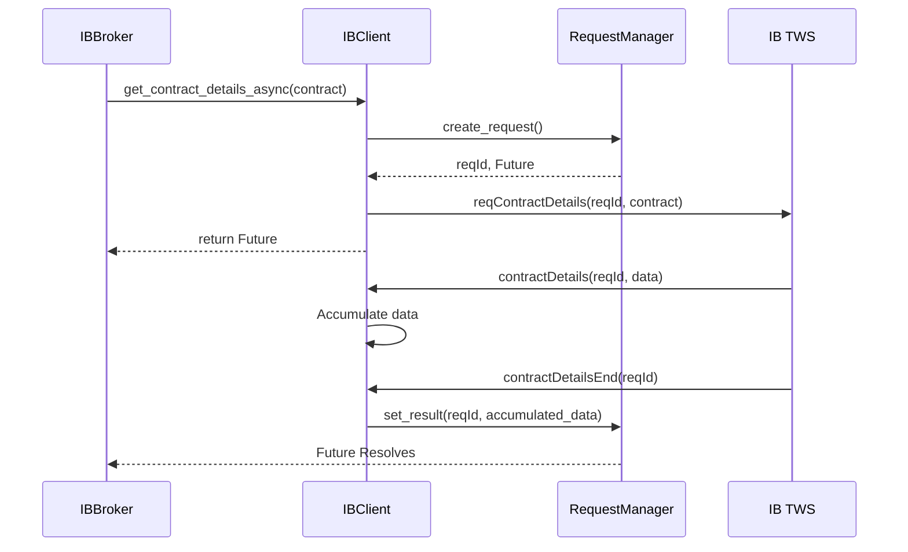

# Modular Trading System

A comprehensive, modular Python trading system designed to work with Interactive Brokers and easily extensible to other brokers and exchanges. This system provides a unified interface for algorithmic trading, historical data retrieval, order management, and real-time market data processing.

## Features

### Core Functionality
- **Historical Data Retrieval**: Get OHLCV data with customizable timeframes
- **Order Management**: Submit, track, and cancel orders with full status monitoring
- **Real-time Market Data**: Subscribe to live price feeds with callback support
- **Multi-Broker Support**: Modular architecture allows easy addition of new brokers
- **Data Persistence**: SQLite database for caching data and storing order/trade history
- **Account Management**: Access account information and positions across brokers
### Sequence Diagram

```mermaid
sequenceDiagram
    participant User
    participant TradingSystem
    participant EventEngine
    participant BrokerFactory
    participant IBBroker
    
    User->>TradingSystem: add_broker("ib", host="127.0.0.1")
    TradingSystem->>BrokerFactory: create_broker("ib", config)
    BrokerFactory-->>TradingSystem: IBBroker instance
    TradingSystem->>IBBroker: connect()
    IBBroker-->>TradingSystem: Connection Successful
    
    User->>TradingSystem: subscribe_market_data("AAPL")
    TradingSystem->>IBBroker: subscribe_market_data(contract)
    IBBroker-->>TradingSystem: reqId
    
    loop Market Data Stream
        IBBroker->>EventEngine: put(tick_event)
        EventEngine->>TradingSystem: process(tick_event)
        TradingSystem->>User: callback(tick_data)
    end
```

### Architecture

```mermaid
graph TD
    User[User / Strategy] -->|Submit Order| OM[OrderManager]
    User -->|Subscribe Data| DM[DataManager]
    
    OM -->|Route Order| BF[BrokerFactory]
    DM -->|Request Data| BF
    DM -->|Subsribe| EE[EventEngine]
    
    BF -->|Create| IB[IBBroker]
    
    subgraph "Interactive Brokers Integration"
        IB -->|Async Request| IBC[IBClient]
        IBC -->|Map Request| RM[IBRequestManager]
        RM -->|Return Future| IBC
        IBC -->|Send to API| TWS[IB TWS/Gateway]
        TWS -->|Callback| IBC
        IBC -->|Resolve Future| RM
        RM -->|Result| IB
    end
    
    IB -->|Order Updates| OM
    IB -->|Market Data| EE
    EE -->|Async Event| DM
```

- **Broker Abstraction Layer**: Unified interface for different brokers
- **Factory Pattern**: Easy instantiation and management of broker connections
- **Event-Driven**: Callback system for order updates and market data
- **Modular Design**: Clean separation of concerns for easy maintenance and extension

### System Class Diagram


```mermaid
classDiagram
    class TradingSystem {
        +add_broker(name, type)
        +submit_order(order)
        +get_historical_data(contract)
        +subscribe_market_data(contract)
    }

    class BrokerFactory {
        +register_broker(type, class)
        +create_broker(type, config) BrokerInterface
    }

    class BrokerInterface {
        <<interface>>
        +connect()
        +disconnect()
        +submit_order(order)
        +get_historical_data(contract)
        +subscribe_market_data(contract)
    }

    class IBBroker {
        -client: IBClient
        -request_manager: IBRequestManager
        +connect()
        +submit_order(order)
    }

    class IBClient {
        +reqContractDetails()
        +reqHistoricalData()
        +reqMktData()
        +get_contract_details_async()
    }
    
    class IBRequestManager {
        +create_request() (reqId, Future)
        +set_result(reqId, result)
        +set_error(reqId, error)
    }

    class PaperBroker {
        +connect()
        +submit_order(order)
    }

    class DataManager {
        -cache: MemoryCache
        -db: SQLiteDB
        +get_historical_data()
        +save_tick_data()
    }

    class OrderManager {
        -orders: Dict
        +submit_order(order)
        +on_order_status(status)
    }

    class StrategyManager {
        +register_strategy(strategy)
        +start()
        +stop()
    }
    
    class StrategyEngine {
        +run_backtest()
        +simulate_market()
    }

    class EventEngine {
        +put(event)
        +start()
        +stop()
        +register(type, handler)
    }

    TradingSystem --> BrokerFactory
    TradingSystem --> DataManager
    TradingSystem --> OrderManager
    TradingSystem --> EventEngine
    
    BrokerFactory ..> BrokerInterface : Creates
    IBBroker --|> BrokerInterface
    PaperBroker --|> BrokerInterface
    
    IBBroker --> IBClient
    IBClient --> IBRequestManager
    
    StrategyManager --> TradingSystem : Uses
    StrategyManager --> StrategyEngine : Uses (Backtest)
    
    EventEngine ..> DataManager : Async Updates
```

## Interactive Brokers Implementation Detail

The IB integration uses a **Request Manager** pattern to bridge the asynchronous, callback-based `ibapi` with the synchronous/async-await style of the trading core.

### The Request Flow

1.  **Request Initiation**: `IBBroker` calls an async method on `IBClient` (e.g., `get_contract_details_async`).
2.  **Future Creation**: `IBClient` asks `IBRequestManager` for a new `reqId`. The manager creates a Python `Future` and maps it to the ID.
3.  **API Call**: `IBClient` sends the request to TWS using the `reqId`.
4.  **Accumulation**: As callbacks arrive (e.g., `contractDetails`), `IBClient` accumulates data in a temporary buffer.
5.  **Completion**: When the "End" callback arrives (e.g., `contractDetailsEnd`), `IBClient` retrieves the `Future` from `IBRequestManager` and sets the result.
6.  **Response**: The `Future` resolves, and `IBBroker` receives the data.


```mermaid
sequenceDiagram
    participant Broker as IBBroker
    participant Client as IBClient
    participant Manager as RequestManager
    participant TWS as IB TWS

    Broker->>Client: get_contract_details_async(contract)
    Client->>Manager: create_request()
    Manager-->>Client: reqId, Future
    Client->>TWS: reqContractDetails(reqId, contract)
    Client-->>Broker: return Future
    
    TWS->>Client: contractDetails(reqId, data)
    Client->>Client: Accumulate data
    
    TWS->>Client: contractDetailsEnd(reqId)
    Client->>Manager: set_result(reqId, accumulated_data)
    Manager-->>Broker: Future Resolves
```

## Detailed Configuration

Configuration is managed via `config.yaml`, creating a single source of truth for:
-   **Broker Settings**: Host, port, client IDs.
-   **System Paths**: Data directories, log paths.
-   **Trading defaults**: Risk limits, default quantities.

The system uses `pydantic-settings` to load this configuration and allow environment variable overrides (e.g., `TRADING_SYSTEM_BROKERS__INTERACTIVE_BROKERS__HOST=192.168.1.5`).

### Key Components
**BrokerInterface**: Abstract base class that defines the interface all brokers must implement. This ensures consistency across different broker implementations.
**DataManager**: Handles historical and real-time data, including caching, retrieval, and storage in SQLite database.
**OrderManager**: Manages order lifecycle, tracks status, and maintains order history with complete audit trail.
**BrokerFactory**: Factory pattern implementation for creating broker instances with proper configuration.

### Supported Features
- **Order Types**: Market, Limit, Stop orders
- **Asset Classes**: Stocks
- **Time in Force**: GTC
- **Position Tracking**: Real-time position monitoring
- **Trade History**: Trade history

## Installation

### Prerequisites

1. **Python 3.7 or higher**
2. **Interactive Brokers TWS or IB Gateway** (for IB integration)
3. **Required Python packages**:

```bash
pip install pandas sqlite3 ibapi
```

### Interactive Brokers Setup

1. **Download and install TWS or IB Gateway** from Interactive Brokers
2. **Enable API access**:
   - Open TWS/Gateway
   - Go to File Global Configuration API Settings
   - Check "Enable ActiveX and Socket Clients"
   - Set Socket port (7497 for paper trading, 7496 for live)
   - Check "Allow connections from localhost only"
   - Optionally check "Read-Only API" for testing

3. **Create paper trading account** (recommended for testing)

### System Setup

1. **Clone or download the trading system files**
2. **Install the package** (optional):
```bash
pip install -e .
```

3. **Configure settings** in `config.yaml`:
```yaml
brokers:
  interactive_brokers:
    host: "127.0.0.1"
    port: 7497
    client_id: 1
system:
  log_level: "INFO"
```

## Quick Start

### Basic Usage Example

```python
from unified_trading_platform.trading_core.trading_system import TradingSystem

# Initialize the system
trading_system = TradingSystem()

# Add Interactive Brokers
trading_system.add_broker(
    name="ib_paper",
    broker_type="ib",
    host="127.0.0.1",
    port=7497,
    client_id=1
)

# Get historical data
hist_data = trading_system.data_manager.get_historical_data(
    contract=Contract(symbol="AAPL", secType="STK", exchange="SMART", currency="USD"),
    duration="5 D",
    bar_size="1 hour",
    what_to_show="TRADES"
)

print(hist_data.head())

# Submit a limit order
order_id = trading_system.submit_limit_order(
    symbol="AAPL",
    exchange="SMART", 
    action="BUY",
    quantity=100,
    limit_price=150.00,
    broker_name="ib_paper"
)

# Check order status
status = trading_system.get_order_status(order_id)
print(f"Order status: {status}")

# Clean shutdown
trading_system.shutdown()
```

### Running the Examples

**Basic functionality example**:
```bash
python examples/example_ib.py
```

**Strategy backtesting**:
```bash
python examples/example_strategy_manager.py
```

## API Reference

### TradingSystem Class

The main interface for the trading system.

#### Methods

**Broker Management**
- `add_broker(name, broker_type, **config)` - Add and connect to a broker
- `remove_broker(name)` - Remove and disconnect from a broker

**Historical Data**
- `get_historical_data(symbol, exchange, duration, bar_size, ...)` - Get historical OHLCV data

**Market Data**
- `subscribe_market_data(symbol, exchange, callback, ...)` - Subscribe to real-time data

**Order Management**
- `submit_market_order(symbol, exchange, action, quantity, broker_name, ...)` - Submit market order
- `submit_limit_order(symbol, exchange, action, quantity, limit_price, broker_name, ...)` - Submit limit order
- `submit_stop_order(symbol, exchange, action, quantity, stop_price, broker_name, ...)` - Submit stop order
- `cancel_order(order_id)` - Cancel an order
- `get_order_status(order_id)` - Get order status
- `get_all_orders()` - Get all orders

**Account Information**
- `get_positions(broker_name)` - Get current positions
- `get_account_info(broker_name)` - Get account information

**History**
- `get_order_history(symbol, start_date, end_date)` - Get order history
- `get_trade_history(symbol, start_date, end_date)` - Get trade history

### Contract Specification

```python
from trading_core.brokers.base_broker import Contract
from trading_core.data_models.security_type_enum import SecurityType

contract = Contract(
    symbol="AAPL",           # Symbol
    security_type=SecurityType.STOCK,     # STK, CASH, FUT, OPT, etc.
    exchange="NASDAQ",       # Exchange
    currency="USD",          # Currency
    expiry="20231215",       # For futures/options
    strike=150.0,            # For options
    right="C"                # C for Call, P for Put
)
```

### Order Specification

```python
from trading_core.brokers.base_broker import Order, OrderType, OrderAction

order = Order(
    action=OrderAction.BUY,     # BUY or SELL
    quantity=100,               # Number of shares/contracts
    order_type=OrderType.LIMIT, # MARKET, LIMIT, STOP, STOP_LIMIT
    limit_price=150.00,         # For limit orders
    stop_price=145.00,          # For stop orders
    time_in_force="DAY"         # DAY, GTC, IOC, FOK
)
```

## Architecture Overview

### Directory Structure
```
unified_trading_platform/
    __init__.py
    api/                    # API Endpoints & Runtime
    docs/                   # Documentation
    examples/               # Usage Examples
    trading_core/
        __init__.py
        trading_system.py   # Main TradingSystem class
        event_system.py     # Event Engine
        brokers/
           __init__.py
           base_broker.py
           broker_factory.py
           interactive_brokers/
        data/
           __init__.py
           data_manager.py
        orders/
           __init__.py
           order_manager.py
        strategies/         # Strategy implementations
        strategy_engine/    # Core Strategy Logic
        data_models/        # Pydantic Models
```

## Adding New Brokers

To add a new broker (e.g., Alpaca, TD Ameritrade):

1. **Create broker implementation**:
```python
# trading_system/brokers/alpaca/alpaca_broker.py
from ..base_broker import BrokerInterface

class AlpacaBroker(BrokerInterface):
    def connect(self, **kwargs):
        # Implementation here
        pass

    def get_historical_data(self, contract, duration, bar_size, what_to_show):
        # Implementation here
        pass

    # ... implement all required methods
```

2. **Register with factory**:
```python
# trading_system/brokers/broker_factory.py
from .alpaca.alpaca_broker import AlpacaBroker
BrokerFactory.register_broker('alpaca', AlpacaBroker)
```

3. **Use the new broker**:
```python
trading_system.add_broker(
    name="alpaca_live",
    broker_type="alpaca",
    api_key="your_key",
    secret_key="your_secret"
)
```

## Examples and Testing

### Running Tests

Basic functionality test:
```bash
python example_usage.py
```

Strategy backtesting:
```bash
python strategy_example.py
```
