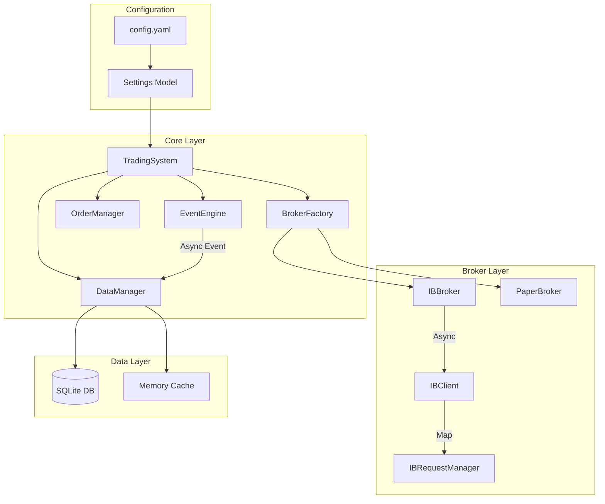
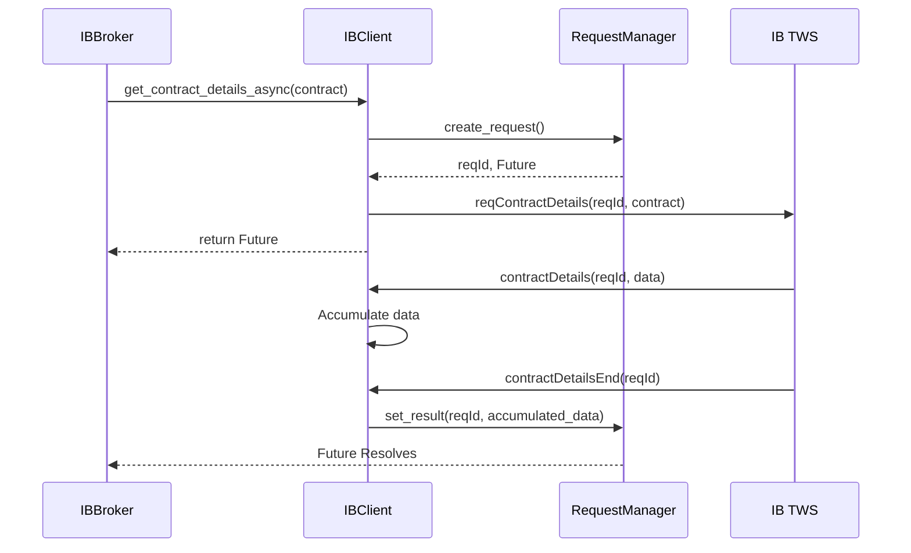
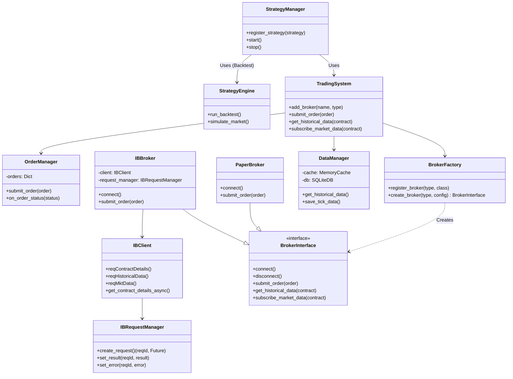

# System Architecture

## Overview
The Modular Trading System is designed with a layered architecture to ensure separation of concerns. It employs an **Event-Driven Architecture** for market data processing to ensure that high-frequency broker callbacks do not block the main application logic.

## Interactive Brokers Implementation

The IB integration uses a **Request Manager** pattern to bridge the asynchronous, callback-based `ibapi` with the synchronous/async-await style of the trading core.

### The Request Flow

1.  **Request Initiation**: `IBBroker` calls an async method on `IBClient` (e.g., `get_contract_details_async`).
2.  **Future Creation**: `IBClient` asks `IBRequestManager` for a new `reqId`. The manager creates a Python `Future` and maps it to the ID.
3.  **API Call**: `IBClient` sends the request to TWS using the `reqId`.
4.  **Accumulation**: As callbacks arrive (e.g., `contractDetails`), `IBClient` accumulates data in a temporary buffer.
5.  **Completion**: When the "End" callback arrives (e.g., `contractDetailsEnd`), `IBClient` retrieves the `Future` from `IBRequestManager` and sets the result.
6.  **Response**: The `Future` resolves, and `IBBroker` receives the data.

## Configuration

Configuration is managed via `config.yaml`, creating a single source of truth for:
-   **Broker Settings**: Host, port, client IDs.
-   **System Paths**: Data directories, log paths.
-   **Trading defaults**: Risk limits, default quantities.

The system uses `pydantic-settings` to load this configuration and allow environment variable overrides (e.g., `TRADING_SYSTEM_BROKERS__INTERACTIVE_BROKERS__HOST=192.168.1.5`).

## System Class Diagram

